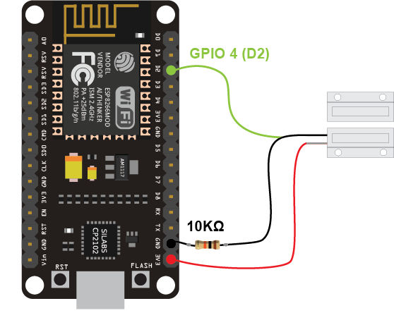

## Alarma-de-puerta-con-sirena-y-Telegram-en-ESP8266
Alarma de seguridad con sirena comunitaria que se activa cuando una puerta está abierta. Se puede controlar la activación y notificación mediante Telegram.

